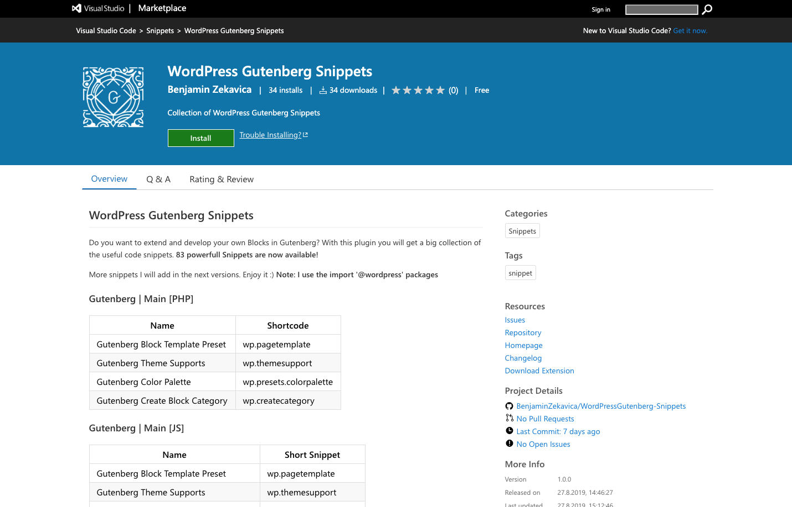

# Gutenberg WordPress Handbuch

Was möchte ich dir hier zeigen

Ich weiß, dass die WordPress Gutenberg Dokumentation ziemlich schrecklich ist und manchen Entwickler nicht wirklich ans Ziel bringt. Bitte dennoch schau regelmäßig auf der offiziellen Seite nach, um Up-To-Date zu bleiben.

[**Hier geht es zur WordPress Gutenberg Dokumentation!**](https://developer.wordpress.org/block-editor/)

Im Gutenberg Editor ändern sich andauert neue Dinge, die die Entwicklung schwieriger machen als es sein muss. Ich habe mir in den letzten Wochen viel Zeit für Nachforschung genommen, damit die verzweifelten Entwickler endlich Hilfe kriegen.

**In dieser Dokumentation schauen wir uns folgende Dinge an:**

* Erweiterte Funktionen und deren richtige Anwendung in JSX
* JSX Basis \( Conditionals, Ausgaben, Schleifen ... \)
* Dynamic Blocks / Erweitert
* Gutenberg Blöcke wurden unerwartet bearbeiten \( Lösung\)
* Mit React richtig arbeiten
* React Plugins & Components aus der Community in WP anwenden
* Und extrem vieles mehr

### Code Editor

Derzeit implementiere ich alle nötigen Snippets von Gutenberg in einem Plugin. Installiere dir dafür schon mal Visual Studio Code! Dieser Editor ist meiner Meinung nach extrem gut geworden. Atom und co. können da einpacken :D

[WordPress Gutenberg Snippets für den Visual Studios Code herunterladen.](https://marketplace.visualstudio.com/items?itemName=BenjaminZekavica.wordpress-gutenberg-snippets)

