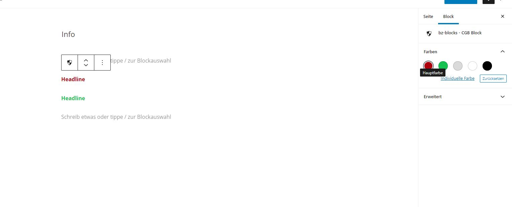

# Color Component



## Einleitung

Heute wollen zu unserem Block eine Art von Color Picker hinzufügen, allerdings etwas eleganter und mit einer Auswahl an Standardfarben, die wir mittels [CSS Variablen ](color-palette-css-variablen-in-gutenberg.md)herauslesen.&#x20;

### Komponenten importieren

Zunächst importieren wir uns die Komponenten aus Gutenberg, die wir benötigen:&#x20;

```javascript
const { ColorPalette } = wp.blockEditor;
const { PanelBody } = wp.components;
const { InspectorControls } = wp.editor;

/* Falls mal keine Standardfarben aus dem globalen Setting haben möchte, kann man
das verwenden */ 

const { ColorPalette } = wp.components;
```

### Attribute erzeugen

Dann erstellen wir neue Attribute, wo wir dann die Werte speichern könne

```javascript
attributes: {
		color: {
			type: 'string'
		}
}
```

### Code erzeugen und Werte speichern

```javascript
	<Fragment>
		<InspectorControls>
			<PanelBody title="Farben" initialOpen={ true }>
				<ColorPalette 
					className="bz__colors-palette"
					color={ props.attributes.color }
					onChange={ ( color ) => {
						props.setAttributes( { 
							color: color
						});
					}}
				/>
			</PanelBody>
		</InspectorControls>
		<h4 style={ { color: props.attributes.color } }>
			Headline
		</h4>
	</Fragment>
```
