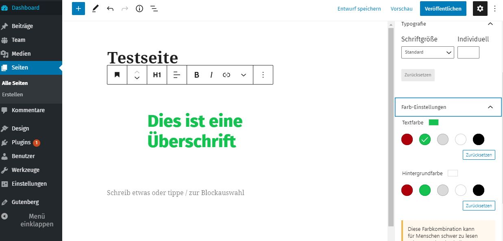

# Color Palette – CSS Variablen in Gutenberg

Die Idee mit den CSS Variablen vereinfacht viele Entwicklern das Leben. Damit man nun als Entwickler das volle Potenzial von WordPress Gutenberg rausholen kann, kann man eine Palette von Standardfarben in WordPress definieren durch die sogenannten Theme Supports.&#x20;

Falls du die Variante mittels **CSS Variablen** für dein Theme ausgewählt hast, bist du auf der sicheren Seite. Mittels ein paar neuen Befehlen kannst du das volle Potential aus Gutenberg rausholen.&#x20;

### CSS Variablen anlegen

Einfach in deiner CSS folgende CSS Regel kopieren und die Namen sowie die Werte austauschen und nach Belieben anpassen.&#x20;

```css
:root {
  --maincolor: #ad000c;
  --secound-color: #15c151;
  --grey: #dadada;
  --white: #ffffff;
  --black: #000000;
}
```

### CSS Variablen ausrufen im Code

in CSS gibt es die Funktion var() und innerhalb der Funktion gibst du als Parameter eine CSS Variable ein. Hier ein Beispiel:&#x20;

```css
.test {
    background-color: var(--maincolor);
}
```

### Gutenberg Color Palette&#x20;

Neben der Color Palette gibt es auch den [Farbverlaufs Component](farbverlauf-component.md). Dort kann man auch einen vordefinierten Farbverlauf anlegen oder auch mittels den Theme Supports eine Standardfarbe auswählen. In einem anderen Beitrag wird deutlich erklärt, wie man in React das Color Palette einfügt z.B. in den **Inspector Controls**. \
\
In dieser Doku behandeln wir ausschließlich nur CSS Variablen Default in Gutenberg für WordPress.

### Theme Support&#x20;

Öffne deine functions.php und füge folgenden Code ein:&#x20;

```php
add_theme_support(
    'editor-color-palette', [
        [
            'name' => 'Hauptfarbe',
            'slug' => 'primary-color',
            'color' => 'var(--maincolor)'
        ],
        [
            'name' => 'Sekundärfarbe',
            'slug' => 'secound-color',
            'color' => 'var(--secound-color)'
        ],
        [
            'name' => 'Grau',
            'slug' => 'grey',
            'color' => 'var(--grey)'
        ],
        [
            'name' => 'Weiß',
            'slug' => 'white',
            'color' => 'var(--white)'
        ],
        [
            'name' => 'Schwarz',
            'slug' => 'black',
            'color' => 'var(--black)'
        ]
    ]
);
```

Wenn du alles gemacht hast, vergewissere dich vorher, dass du deinen Browser Cache gelöscht hast, falls du die CSS nachträglich geändert hast. **Und Tadaaa...**&#x20;



Wie man in der PHP sieht ruft man einfach unter color direkt die **CSS Variable** raus und es klappt.&#x20;
