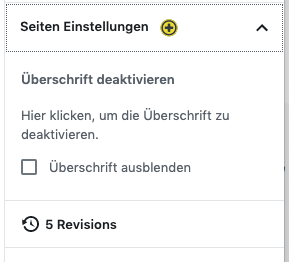

# Option Settings

### Globale Panel für die Custom Post Type

Falls du eine globale Seiten Einstellung machen möchtest, kannst du mittels dem Gutenberg Plugin Register neue Panels sowie neue Sidebars programmieren. 



#### Erstmal importieren wir uns alle wichtigen Dependencies 

```javascript
import { prwp_icon } from "../../icons/icon";
import { CheckboxControl } from "@wordpress/components";
import { PluginDocumentSettingPanel } from "@wordpress/edit-post"; 
import { registerPlugin } from "@wordpress/plugins";
import { Fragment } from "@wordpress/element";

import { withSelect, withDispatch } from '@wordpress/data';
import { compose } from '@wordpress/compose';

```

#### Wir definieren uns eine Funktion und arbeiten mit dem Component "PluginDocumentSettingPanel" vom "wp.edit-post" Package.

```jsx
const prwp_gutenberg_global_setting = () => {

    let prwp_pageSetting = () => (

        <PluginDocumentSettingPanel
            name="page-settings"
            title="Seiten Einstellungen"
            className="prwp__page--settings yellow__background">
            
            <section className="prwp__page--setting__border prwp__page--settings__title">
                <div className="prwp__page--settings__title__desc">
                    <h4>Überschrift deaktivieren</h4>
                    <p>
                        Hier klicken, um die Überschrift zu deaktivieren.
                    </p>
                </div>
                <div className="prwp__page--settings__title__toggle">
                    <HideTitle />
                </div>
            </section>

    
        </PluginDocumentSettingPanel>
    );

    registerPlugin( 'pagesettings-prwp', { render: prwp_pageSetting,  icon: prwp_icon } );
}
prwp_gutenberg_global_setting();
```

