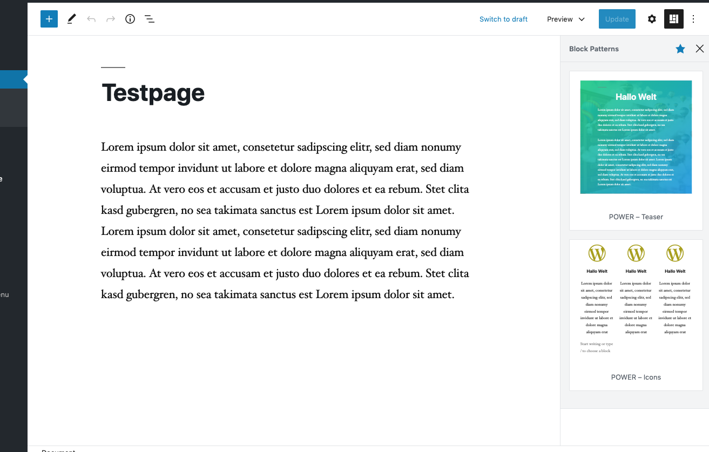
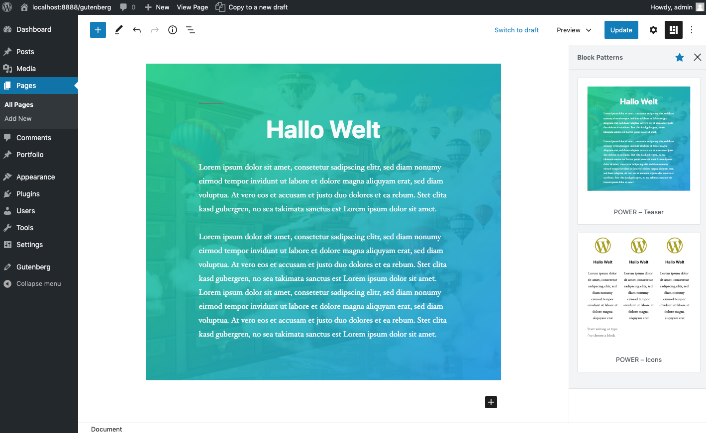

# Block Pattern

**Hinweis: Diese Funktion ist derzeit noch in Entwicklung. Diese Funktion ist derzeit im Gutenberg Plugin und wird in der WordPress Version 5.5 final im Code verfügbar sein.**   
  
In der neuen Gutenberg Plugin Version wurden die Block Pattern vorgestellt. Hier handelt es sich um vordefinierte Blöcke, die man mit einem Klick hinzufügen kann und dann ausschließlich den Inhalt zu bearbeiten.   
  
Die Funktion ist ähnlich wie die **wiederverwendbare Blöcke**. Hat allerdings ein paar Nachteile, die bald aber behoben  und noch erweitert werden. 


### Alle Blöcke entfernen 

Als Entwickler möchte man natürlich alle vordefinierten Blöcke entfernen, um den Kunden ausschließlich die entwickelten Blöcke anzeigen. Hier habe ich ein kleines Skript geschrieben, die alle derzeitigen  Blöcke von der Leiste entfernt.   
  
Ihr könnt diese natürlich optional anpassen, falls Ihr ein paar Blöcke noch in der Sidebar lassen wollt.  Schreibt diesen Code einfach in eurer **functions.php** oder in eurem **Plugin**. 

```php
// Pattern alle entfernen
function prwpRemovePattern() {
  unregister_pattern( 'core/text-two-columns' );
	unregister_pattern( 'core/two-buttons' );
	unregister_pattern( 'core/cover-abc' );
	unregister_pattern( 'core/two-images' );
	unregister_pattern( 'core/hero-two-columns' );
	unregister_pattern( 'core/numbered-features' );
	unregister_pattern( 'core/its-time' );
}
add_action( 'init', 'prwpRemovePattern' );
```

### Neue Blöcke hinzufügen

Natürlich möchte man auch neue Styles hinzufügen, deswegen bietet WordPress diese tolle PHP Funktionen an, die das Leben deutlich angenehmer machen. 



Durch die **register\_pattern** PHP-Funktion können wir ab sofort neue Vorlagen definieren. Die Ansicht wird automatisch aus dem **Content Bereich** verarbeitet. 

```php
// Add Pattern
function prwpAddPattern(){
   if ( function_exists( 'register_pattern' ) ) {
      register_pattern(
         'prwp/powerteaser',
         array(
            'title'   => 'POWER – Teaser',
            'content' => "<!-- wp:group -->\n<div class=\"wp-block-group\"><div class=\"wp-block-group__inner-container\"><!-- wp:cover {\"url\":\"http://localhost:8888/gutenberg/wp-content/uploads/2018/08/schublade-teaser.jpg\",\"id\":17,\"dimRatio\":90,\"minHeight\":637,\"minHeightUnit\":\"px\",\"gradient\":\"vivid-green-cyan-to-vivid-cyan-blue\",\"className\":\"alignwide\"} -->\n<div class=\"wp-block-cover has-background-dim-90 has-background-dim has-background-gradient alignwide\" style=\"background-image:url(http://localhost:8888/gutenberg/wp-content/uploads/2018/08/schublade-teaser.jpg);min-height:637px\"><span aria-hidden=\"true\" class=\"wp-block-cover__gradient-background has-vivid-green-cyan-to-vivid-cyan-blue-gradient-background\"></span><div class=\"wp-block-cover__inner-container\"><!-- wp:heading {\"align\":\"center\"} -->\n<h2 class=\"has-text-align-center\">Hallo Welt</h2>\n<!-- /wp:heading -->\n\n<!-- wp:paragraph {\"align\":\"left\",\"fontSize\":\"normal\"} -->\n<p class=\"has-text-align-left has-normal-font-size\">Lorem ipsum dolor sit amet, consetetur sadipscing elitr, sed diam nonumy eirmod tempor invidunt ut labore et dolore magna aliquyam erat, sed diam voluptua. At vero eos et accusam et justo duo dolores et ea rebum. Stet clita kasd gubergren, no sea takimata sanctus est Lorem ipsum dolor sit amet. </p>\n<!-- /wp:paragraph -->\n\n<!-- wp:paragraph {\"fontSize\":\"normal\"} -->\n<p class=\"has-normal-font-size\">Lorem ipsum dolor sit amet, consetetur sadipscing elitr, sed diam nonumy eirmod tempor invidunt ut labore et dolore magna aliquyam erat, sed diam voluptua. At vero eos et accusam et justo duo dolores et ea rebum. Stet clita kasd gubergren, no sea takimata sanctus est Lorem ipsum dolor sit amet. Lorem ipsum dolor sit amet, consetetur sadipscing elitr, sed diam nonumy eirmod tempor invidunt ut labore et dolore magna aliquyam erat, sed diam voluptua. At vero eos et accusam et justo duo dolores et ea rebum. Stet clita kasd gubergren, no sea takimata sanctus est Lorem ipsum dolor sit amet.</p>\n<!-- /wp:paragraph --></div></div>\n<!-- /wp:cover --></div></div>\n<!-- /wp:group -->",
         )
      );
      register_pattern(
         'prwp/icons',
         array(
            'title'   => 'POWER – Icons',
            'content' => "<!-- wp:columns {\"align\":\"wide\"} -->\n<div class=\"wp-block-columns alignwide\"><!-- wp:column -->\n<div class=\"wp-block-column\"><!-- wp:prwp-blocks/iconpicker {\"choosedIcon\":\"fab fa-wordpress-simple\",\"iconColorHex\":\"#a8a000\",\"iconFontSize\":100,\"iconContentsToggle\":true,\"iconContentHeadline\":\"Hallo Welt\",\"iconContentDesc\":\"Lorem ipsum dolor sit amet, consetetur sadipscing elitr, sed diam nonumy eirmod tempor invidunt ut labore et dolore magna aliquyam erat\"} /-->\n\n<!-- wp:paragraph -->\n<p></p>\n<!-- /wp:paragraph --></div>\n<!-- /wp:column -->\n\n<!-- wp:column -->\n<div class=\"wp-block-column\"><!-- wp:prwp-blocks/iconpicker {\"choosedIcon\":\"fab fa-wordpress-simple\",\"iconColorHex\":\"#a8a000\",\"iconFontSize\":100,\"iconContentsToggle\":true,\"iconContentHeadline\":\"Hallo Welt\",\"iconContentDesc\":\"Lorem ipsum dolor sit amet, consetetur sadipscing elitr, sed diam nonumy eirmod tempor invidunt ut labore et dolore magna aliquyam erat\"} /--></div>\n<!-- /wp:column -->\n\n<!-- wp:column -->\n<div class=\"wp-block-column\"><!-- wp:prwp-blocks/iconpicker {\"choosedIcon\":\"fab fa-wordpress-simple\",\"iconColorHex\":\"#a8a000\",\"iconFontSize\":100,\"iconContentsToggle\":true,\"iconContentHeadline\":\"Hallo Welt\",\"iconContentDesc\":\"Lorem ipsum dolor sit amet, consetetur sadipscing elitr, sed diam nonumy eirmod tempor invidunt ut labore et dolore magna aliquyam erat\"} /--></div>\n<!-- /wp:column --></div>\n<!-- /wp:columns -->"
         )
      );
   }
}
add_action( 'init', 'prwpAddPattern' );
```

Als Parameter werden ein **String** mitgegeben und ein **Array**. Innerhalb vom Array vergibt man den Label und unter Content den Inhalt, der vom Editor kommt. 

### Content generieren 

Damit man natürlich eine Vorlage hat, müssen wir diese erst in Gutenberg erzeugen. Sobald man die Blöcke hinzufügt hat klickt man oben auf die **drei Punkte** und zum **Code-Editor.** 


**Dort kopiert man anschließend den Code, der im Editor sieht.** 


**Anschließend gehen wir zu dieser Website:**   
[https://onlinestringtools.com/escape-string](https://onlinestringtools.com/escape-string) 

Gebe dort den Code auf der linken Seite ein und auf der rechten Seite wird der finale Code generiert, der die gesamten Strings nochmal PHP konform umwandelt.   
  
**Gebe den Code nun in der PHP Funktion ein. Und wir sind fertig. Klicke anschließend auf den Blockpattern und wähle deinen erstellten Block Pattern aus und er wird direkt zu deinem Arbeitsbereich hinzufügt.** 



**Weitere Informationen findest du hier:**   
[https://developer.wordpress.org/block-editor/developers/block-api/block-patterns/](https://developer.wordpress.org/block-editor/developers/block-api/block-patterns/)

