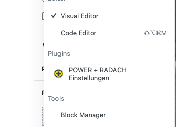

# Option Settings

### Globale Panel für die Custom Post Type

Falls du eine globale Seiten Einstellung machen möchtest, kannst du mittels dem Gutenberg Plugin Register neue Panels sowie neue Sidebars programmieren. 


#### Erstmal importieren wir uns alle wichtigen Dependencies 

```javascript
import { prwp_icon } from "../../icons/icon";
import { CheckboxControl } from "@wordpress/components";
import { PluginDocumentSettingPanel } from "@wordpress/edit-post"; 
import { registerPlugin } from "@wordpress/plugins";
import { Fragment } from "@wordpress/element";

import { withSelect, withDispatch } from '@wordpress/data';
import { compose } from '@wordpress/compose';
```

#### Wir definieren uns eine Funktion und arbeiten mit dem Component "PluginDocumentSettingPanel" vom "wp.edit-post" Package.

```jsx
const prwp_gutenberg_global_setting = () => {

    let prwp_pageSetting = () => (

        <PluginDocumentSettingPanel
            name="page-settings"
            title="Seiten Einstellungen"
            className="prwp__page--settings yellow__background">
            
            <section className="prwp__page--setting__border prwp__page--settings__title">
                <div className="prwp__page--settings__title__desc">
                    <h4>Überschrift deaktivieren</h4>
                    <p>
                        Hier klicken, um die Überschrift zu deaktivieren.
                    </p>
                </div>
                <div className="prwp__page--settings__title__toggle">
                    <HideTitle />
                </div>
            </section>

    
        </PluginDocumentSettingPanel>
    );

    registerPlugin( 'pagesettings-prwp', { render: prwp_pageSetting,  icon: prwp_icon } );
}
prwp_gutenberg_global_setting();
```

#### Jetzt müssen wir nur noch unsere Metabox mit dem Click Event zusammenfassen.

```jsx
let HideTitle = ( props ) => {    
    return(
        <Fragment>
            <CheckboxControl
                checked={ props.headlineActive }
                label="Überschrift ausblenden"
                onChange={ (bool) => { 
                    props.onCheckHeadlineActive(bool)
                }}
            />
        </Fragment>
    )
}

HideTitle = compose([
    withSelect(
        ( select ) => {
            return {
                headlineActive: select('core/editor').getEditedPostAttribute('meta')['_myprefix_text_metafield']
            }
        }
    ), 
    withDispatch(
        ( dispatch ) => {
            return {
                onCheckHeadlineActive: (active) => {
                    wp.data.dispatch('core/editor').editPost( {  meta: { _myprefix_text_metafield: active  }  } )
                }
            }
        }
    )
])( HideTitle )
```

#### Und jetzt das nur für PHP :\( 

Dieses Component arbeitet mittels Meta Fields von WordPress zusammen, was wir nur machen ist: Wir blenden die im Backend aus und dafür nehmen wir unsere Checkbox, die wir fürs Backend genommen haben.  

Damit man nicht diesen komplexen PHP Script schreiben muss, gibt es hilfreiche Tools.   
Hier eine meiner Empfehlungen: [https://jeremyhixon.com/tool/wordpress-meta-box-generator-v2-beta/](https://jeremyhixon.com/tool/wordpress-meta-box-generator-v2-beta/) 

```php
<?php

// Regsiter Meta
function myprefix_register_meta_func( $postType, $fieldname, $type ) {
    register_meta( $postType, $fieldname, array(
        'show_in_rest' => true,
        'type' => $type,'boolean',
        'single' => true,
        'sanitize_callback' => 'sanitize_text_field',
        'auth_callback' => function() { 
            return current_user_can('edit_posts');
        }
    ));
}

function myprefix_register_meta() {
    myprefix_register_meta_func('post', '_myprefix_text_metafield', 'boolean'); 
    myprefix_register_meta_func('page', '_myprefix_text_metafield', 'boolean'); 
    myprefix_register_meta_func('portfolio', '_myprefix_text_metafield', 'boolean'); 
}
add_action('init', 'myprefix_register_meta');


function myprefix_add_meta_box_func( $postType ) {
    add_meta_box( 
        'myprefix_post_options_metabox', 
        'Post Options', 
        'myprefix_post_options_metabox_html', 
        $postType, 
        'normal', 
        'default',
        array('__back_compat_meta_box' => true )
    );
}

function myprefix_add_meta_box() {
    myprefix_add_meta_box_func('post');
    myprefix_add_meta_box_func('page');
    myprefix_add_meta_box_func('portfolio');
}

add_action( 'add_meta_boxes', 'myprefix_add_meta_box' );

function myprefix_post_options_metabox_html($post) {
    $field_value = get_post_meta($post->ID, '_myprefix_text_metafield', true);
    wp_nonce_field( 'myprefix_update_post_metabox', 'myprefix_update_post_nonce' );
    ?>
    <p>
        <label for="myprefix_text_metafield"><?php esc_html_e( 'Text Custom Field', 'textdomain' ); ?></label>
        <br />
        <input class="widefat" type="text" name="myprefix_text_metafield" id="myprefix_text_metafield" value="<?php echo esc_attr( $field_value ); ?>" />
    </p>
    <?php
}

function myprefix_save_post_metabox($post_id, $post) {

    $edit_cap = get_post_type_object( $post->post_type )->cap->edit_post;
    if( !current_user_can( $edit_cap, $post_id )) {
        return;
    }
    if( !isset( $_POST['myprefix_update_post_nonce']) || !wp_verify_nonce( $_POST['myprefix_update_post_nonce'], 'myprefix_update_post_metabox' )) {
        return;
    }

    if(array_key_exists('myprefix_text_metafield', $_POST)) {
        update_post_meta( 
            $post_id, 
            '_myprefix_text_metafield', 
            sanitize_text_field($_POST['myprefix_text_metafield'])
        );
    }

}
add_action( 'save_post', 'myprefix_save_post_metabox', 10, 2 );
```

### Neuen Plugin Tab registrieren 



Falls du gerne deine eigene Sidebar verwalten möchtest, kannst du dir in Gutenberg deine eigene Sidebar ganz einfach programmieren. Du musst nur wieder mit den Meta Fields arbeiten. Aber wie oben erklärt durch die Generatoren wird dir viel Arbeit erspart.  

```jsx
import { prwp_icon } from "../../icons/icon";
import { PluginMoreMenuItem } from "@wordpress/edit-post"; 
import { registerPlugin } from "@wordpress/plugins";

function prwp_gutenberg_tab_option() {

    let sayHello = () => {
        // Hier kannst du alles machen...
        alert('Hello!');
    }

    // Menu Item on Tab Menu -> EventListener to open Modal
    let prwp_tab_setting_one = () => (
        <PluginMoreMenuItem  
            onClick={ sayHello }
            icon={ prwp_icon() } >
            POWER + RADACH Einstellungen
        </PluginMoreMenuItem>
    );
    registerPlugin( 'tabsettings-prwp-one', {  render: prwp_tab_setting_one, icon: prwp_icon } );

}
prwp_gutenberg_tab_option();
```

Hier kannst du zum Beispiel das "Modal" Component verschachteln und dir dein eigenes Einstellungsmenü erstellen.    

